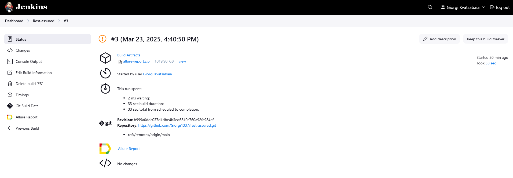
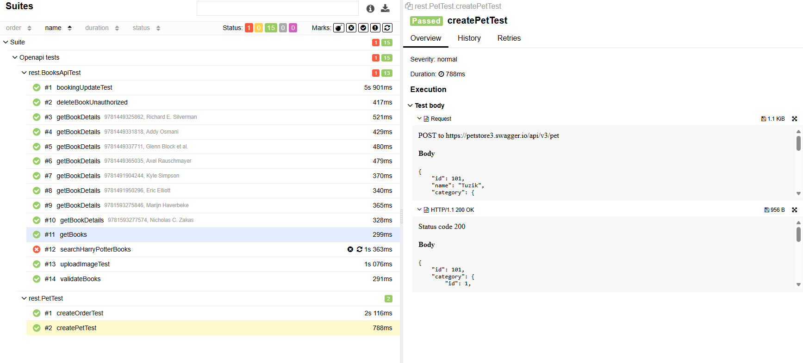

# REST API Test Automation

This project provides automated test cases for testing REST APIs using **RestAssured**, **TestNG**, **OpenAPI Code Generation**, and **Jenkins**. The tests cover various functionalities like book retrieval, booking updates, and pet store interactions.

## Project Structure
- **rest/**: Contains the core test automation code.
    - `BaseTest`: Base class for setting up RestAssured configurations.
    - `BooksApiTest`: Test cases for book store API validation.
    - `PetTest`: Test cases for pet store API interactions.

- **steps/**: Contains reusable step definitions for API interactions.
- **data/**: Stores constants and data providers for parameterized tests.

## Jenkins Integration
This project is integrated with **Jenkins** for automated test execution and continuous integration. Each test run is automatically triggered upon code changes, ensuring consistency and reliability. The integration also provides detailed reports and logs for analysis.

## Allure Report
 Allure report screenshot, which includes detailed test case information and test execution results:

